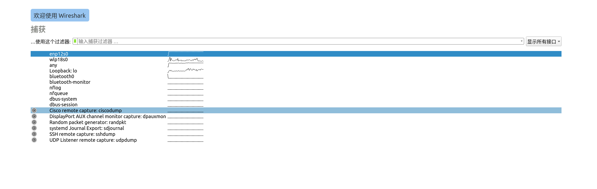
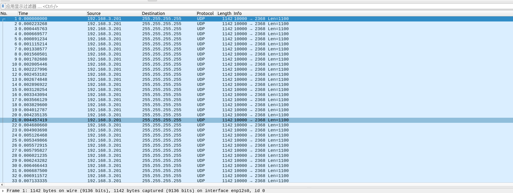

## 写作目的

激光雷达是机器人和自动驾驶领域中最常用的传感器之一。

无论是进行 SLAM、定位导航还是感知算法开发，第一步往往都是先获取激光雷达的数据。而想要获取数据，就必须先与激光雷达建立网络通信。

实际工作中，经常会遇到这样一种情况：

* 新购买的激光雷达，不知道默认 IP；
* 接手同事留下的设备，IP 已经被修改过；
* 实验室设备多人共用，没人记得当前配置；
* 厂家文档丢失或者型号不明确。

这时候如果盲目修改电脑网段进行尝试，效率会非常低。

其实有一个非常实用的方法：

**直接抓取激光雷达发送出来的数据包，从数据包中查看其 IP 地址。**

这个工具就是网络分析神器——Wireshark。

事实上，不只是激光雷达，任何通过网线进行通信的未知设备，都可以通过这种方式快速确定 IP 地址。


## Wireshark 安装

Ubuntu 下直接安装即可：

```bash
sudo apt update
sudo apt install wireshark
```

安装完成后可以直接启动：

```bash
sudo wireshark
```

如果经常使用 Wireshark，建议将当前用户加入 Wireshark 用户组：

```bash
sudo usermod -aG wireshark $USER
```

重新登录后即可直接启动：

```bash
wireshark
```

---

## Wireshark 进行抓包

### 1. 连接激光雷达

首先将激光雷达通过网线连接到电脑。

连接后无需知道激光雷达 IP。

因为我们的目标就是通过抓包找到它。

---

### 2. 选择网卡

启动 Wireshark 后，可以看到当前机器上的所有网络接口。

通常选择：

* Ethernet
* enp*
* eth*

对应的有线网卡。

比如我的有限网卡就是 `enp12s0`



开始抓包。

### 3. 查看数据包

大部分机械式激光雷达会持续向外发送 UDP 数据。

因此即使电脑 IP 配置不正确，也能看到大量的数据包。

此时可以观察：

* Source（源 IP）
* Destination（目标 IP）

例如：

```text
Source:      192.168.1.201
Destination: 255.255.255.255
```

或者：

```text
Source:      192.168.10.108
Destination: 192.168.10.100
```

其中 Source 一般就是激光雷达的 IP 地址。

比如我我的激光雷达ip是192.168.3.101，可以从source中看出来

---

### 4. 使用过滤器

如果数据包较多，可以使用过滤条件。

查看 UDP 数据：

```text
udp
```

查看指定端口：

```text
udp.port == 2368
```

很多激光雷达默认使用：

```text
2368
```

或者：

```text
6699
```

等端口发送点云数据。

不同厂家的端口号可能不同。

过滤后会更容易找到激光雷达发送的数据包。


## 为什么这种方法有效

从计算机网络的角度来看，设备之间进行通信一定会产生网络数据包。

而数据包中天然包含：

* 源 IP
* 目的 IP
* MAC 地址
* 协议类型
* 端口号

Wireshark 本质上就是将网卡接收到的数据包解析出来并展示给用户。

因此只要激光雷达正在发送数据，我们就能够从数据包中找到它的网络信息。


## 总结

当我们拿到一个 IP 未知的激光雷达时，不必急于猜测网段或者修改电脑配置。

最简单的方法就是：

1. 将激光雷达连接到电脑；
2. 使用 Wireshark 抓包；
3. 查看激光雷达发送的数据；
4. 从 Source IP 中确定设备地址。

这个方法不仅适用于激光雷达，也适用于各种通过以太网通信的工业设备、机器人设备以及网络传感器。

学习和理解计算机网络知识，会让很多看似复杂的问题变得非常简单。

而 Wireshark 则是理解网络通信过程最值得掌握的工具之一。


